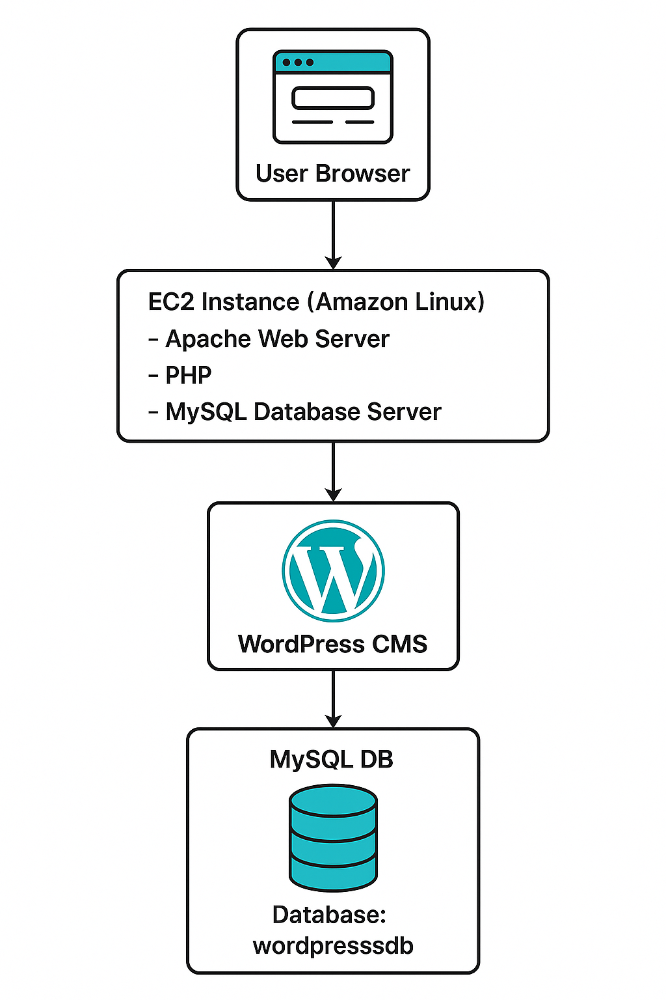

# Wordpress-Deployment

> ####  This Project explain you how to deploy wordpress website on Amazon Ec2 Instance using lamp stack ( Linux , Apache , mysql , Php) . It also enable wordpress theme uploads via vsFTP .

* ## Architecture 

* ## Installation  

### Step 1 : Install Lamp Stack 

   * Create lamp.sh script : 
 
#### bash

          vim lamp.sh     

                    
* Paste the following code :
     
     <a href="./lamp.sh">lamp.sh</a>   

* Make the script executable 
  
  
#### bash

         sudo chmod +x lamp.sh 
    
* Run the script :

#### bash 

          
           sudo ./lamp.sh

### Step 2 : Install Database Connector : 

#### bash 
    
     sudo yum install php8.4-mysqlnd.x86_64

### Step 3 : Download Wordpress : 

#### bash 

     cd /var/www/html
     sudo wget https://wordpress.org/latest.tar.gz
     tar -xvzf <file_name>

### Step 4 : Check The Application 

* Visit 

#### bash
    http://<pub_ip>/wordpress

* ## Database Setup 

### Step 1 : Create database 

#### bash

    mysql -u root -p 

* inside Mysql :

#### bash 

     create database wordpressdb ;

---

### Use the following credentials on Wordpress setup screen : 

#### bash 

    Database Name : Wordpressdb

    Username : root 

    password : root 

    Database Host : localhost 

---

###  Grant Permission To Wordpress Directory

#### bash 
   
     sudo chmod -R 777 wordpress

### Site Setup 

#### bash 

    Site Title : Techblog 

    Username   : root 

    Password   : root 

    Email      : nikhilpatil905703@gmail.com

### Run the installation and login 

#### bash 

    http://<Your-Public-IP>/wordpress

* #### Allow ports 20 and 21 in security group 
 --- 
## Upload Theme Via FTP

### Step 1 : Install vsFTP

#### bash 

    sudo yum install vsftpd -y 
    sudo systemctl start vsftpd 
    sudo systemctl enable vsftpd 

### Step 2 : Add FTP User and Permissions 

#### bash 

      sudo useradd vsftp
      sudo passwd vsftp
      sudo gpasswd -a vsftp apache
      sudo chown -R vsftp:apache /var/www/html/
      sudo systemctl restart vsftpd

### Step 3 : FTP Settings

#### During Theme Upload : 
  
    * Hostname : localhost 

    * FTP Username : vsftp
  
    * FTP Password : root 

* Add New Post 

* Inatall And Activate Themes 

## Summary 

> Deployed **WordPress** on an **AWS EC2 instance** using the **LAMP stack** (Linux, Apache , MariaDB, PHP).  
Apache serves the WordPress site, PHP processes the code, and MariaDB stores the data.  

---

 

                  